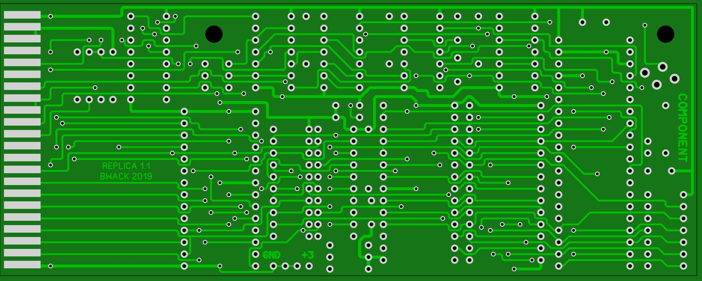
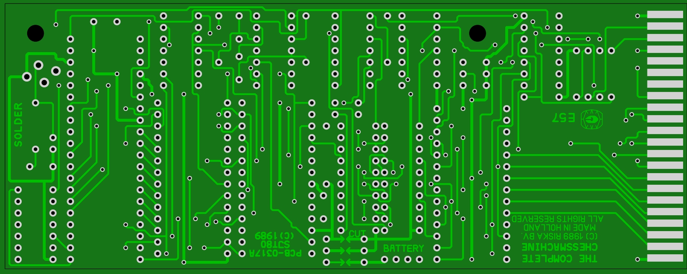

# TheFinalChessCard

TheFinalChessCard for C64/C128, replicated using SprintLayout. Here are the sprint and gerber files.

The scanned images are from the World of Jani blog article about this card.
http://blog.worldofjani.com/?p=3460

## preview images from SprintLayout

